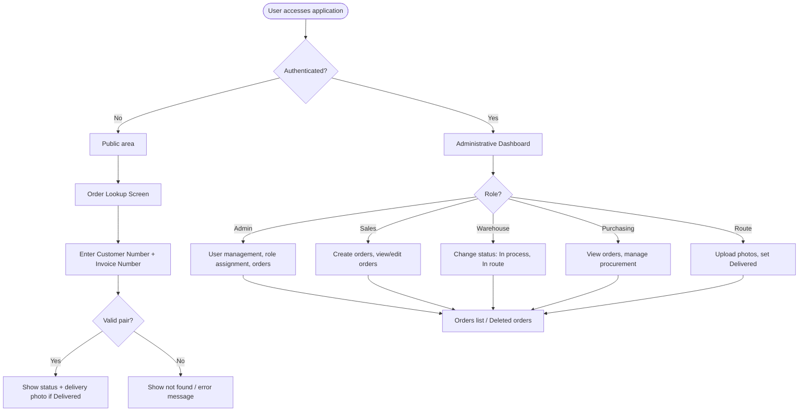

```mermaid
flowchart TD
    Start([User accesses application]) --> Auth{Authenticated?}
    Auth -->|No| Public[Public area]
    Auth -->|Yes| Dashboard[Administrative Dashboard]
    Public --> Lookup[Order Lookup Screen]
    Lookup --> Enter[Enter Customer Number + Invoice Number]
    Enter --> Validate{Valid pair?}
    Validate -->|Yes| Show[Show status + delivery photo if Delivered]
    Validate -->|No| Message[Show not found / error message]
    Dashboard --> Role{Role?}
    Role -->|Admin| AdminTasks[User management, role assignment, orders]
    Role -->|Sales| SalesTasks[Create orders, view/edit orders]
    Role -->|Warehouse| WhTasks[Change status: In process, In route]
    Role -->|Purchasing| PurchTasks[View orders, manage procurement]
    Role -->|Route| RouteTasks[Upload photos, set Delivered]
    AdminTasks --> OrdersList[Orders list / Deleted orders]
    SalesTasks --> OrdersList
    WhTasks --> OrdersList
    PurchTasks --> OrdersList
    RouteTasks --> OrdersList
```
